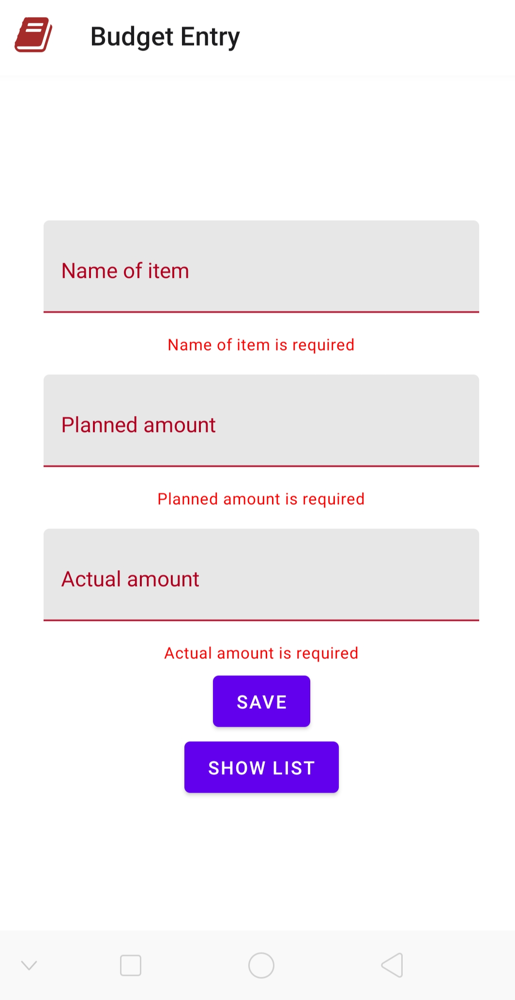

# About Project

- This project is a mobile app made using React native with Expo.
- It is a simple budget entry app.
- It only contains 2 screens.
  - One screen to enter budget.
  - One screen to see list of entered budget.

## Tools Used

- Redux - For State management.
- AsyncStorage - To persist data. It stores data locally.
- redux-thunk - To handle asynchronous calls.

  Storing data inside AsyncStorage is an asynchronous activity, that's why we need redux-thunk.

- react-native-paper - For styling.
  It gives a feel of material UI.
- uuid - It generates random and unique ids.

  As we are storing data in AsyncStorage, ids will not get automatically generated. So we are using uuid to generate unique ids for every budget entry.

# Application Screenshots

### Budget Entry Screen

### Empty Form Submission

### Form with values

### Budget List screen

